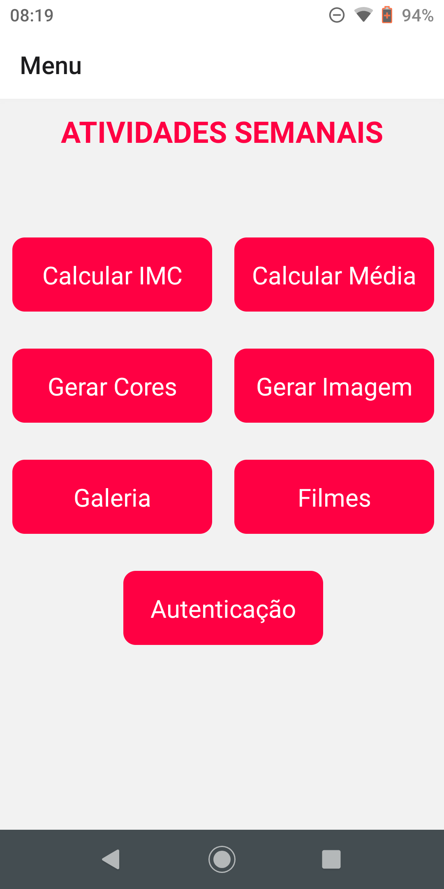
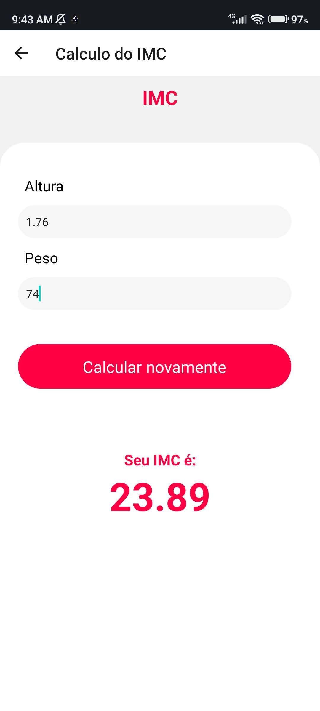
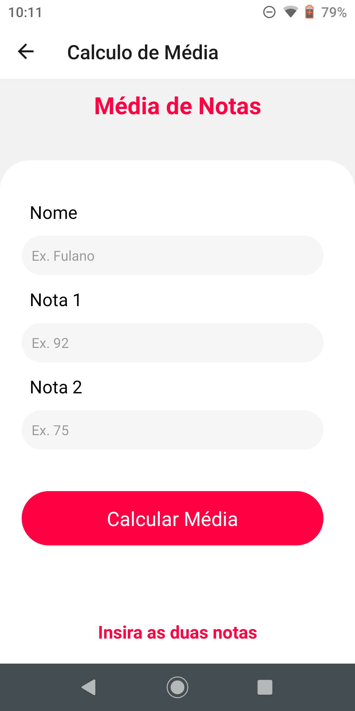
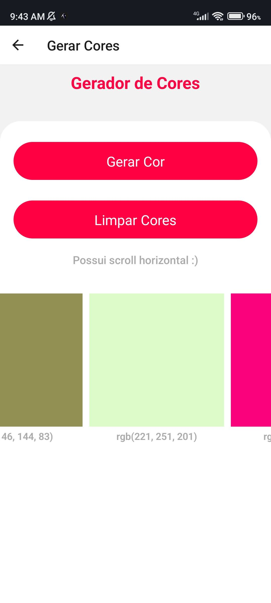
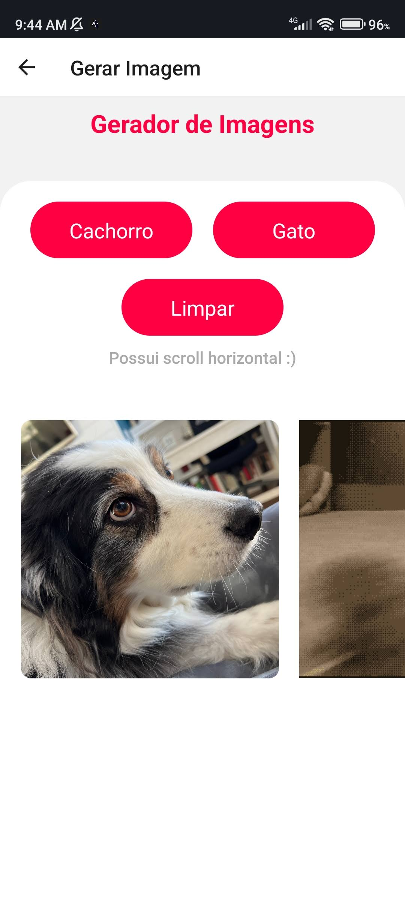
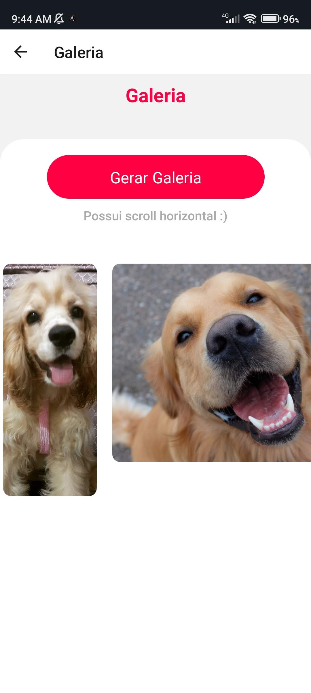
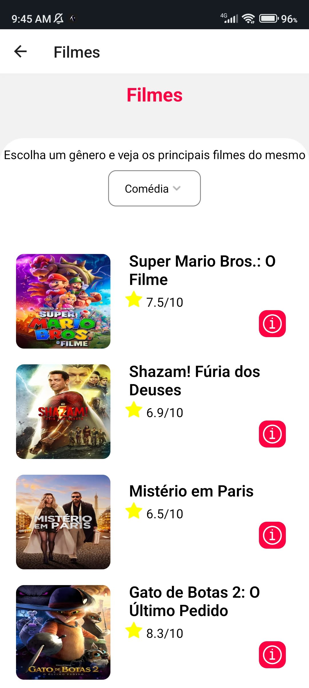
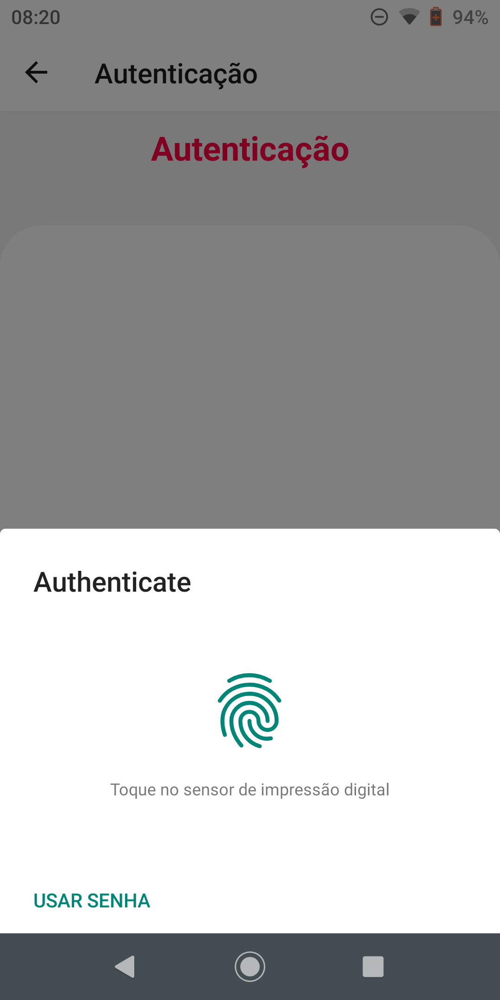

# Atividades Semanais DS151
Este repositório foi criado com o objetivo de armazenar as atividades semanais da matéria "Desenvolvimento para Dispositivos Móveis". Os trabalhos são feitos através de React Native e Expo Go (usado para conseguir rodar a aplicação no smartphone).

##
### Instalação e uso
1. Clone esse repositório e acesse a pasta
   ```sh
   git clone https://github.com/MatheusKerscher/DS151_Matheus_Antonio_Kerscher.git
   cd DS151_Matheus_Antonio_Kerscher/
   ```
   
2. Instale os pacotes NPM
   ```sh
   npm install
   ```
   
3. Rode o App
   ```sh
   npm start
   ```

##
### Funções do Aplicativo
Atualmente o Aplicativo possui quatro funções:
 - Calculo de IMC (Índice de Massa Muscular);
 - Calculo de média de dois valores (usando SQLLite para guardar o histórico de médias);
 - Gerador aleatório de cores;
 - Gerador aleatório de imagens;
 - Galeria de imagens aleatórias com tamanhos aleatórios;
 - Busca de filmes por gênero.
 - Autenticação com uso do leitor de digital 
 
 A função de geração aleatória de imagens faz uso de duas API's a  [the Cat API](https://thecatapi.com/) para trazer imagens de gatos e a  [the Dog API](https://thedogapi.com/) para trazer as imagens dos cachorros. A função da galeria também faz uso da **the Dog API** para poder apresentar as imagens para o usuário. Por fim a função de busca de filmes por gênero faz uso da  [TMDB API](https://www.themoviedb.org/documentation/api) tanto para trazer os gêneros que o usuário pode escolher como para trazer os filmes após a escolha do gênero.

Coforme o passar das semanas esse aplicativo irá ganhando mais funções e será feito refatorações por mim mesmo, para aplicar o que estou apredendo melhorar o que já existe.

##
### Imagens do aplicativo
A seguir seguem algumas imagens de como o aplicativo é









